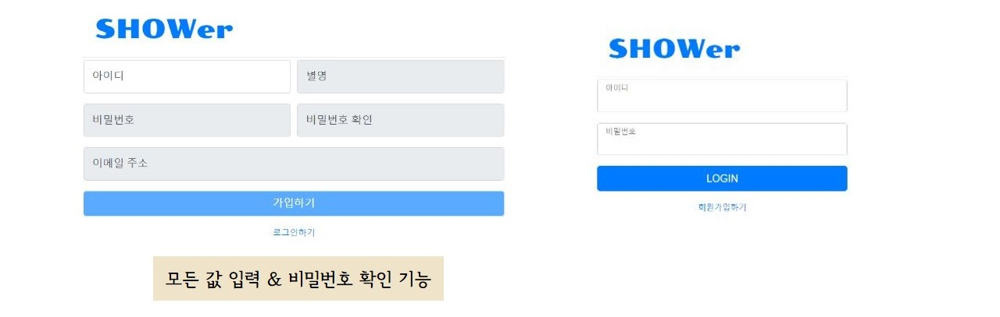

## 문화콘텐츠 리뷰사이트 (SHOWer) :clapper: :ticket: :headphones:

> T4IR 6조 : 이경헌 안소현 백승엽 김정대

- **프로젝트 주제 :** Spring MVC와 mybatis를 활용한 문화콘텐츠 정보 제공 및 리뷰 공유 웹 서비스
- **사용하는 소프트웨어 :**

- **주요 기능 :**

- **시스템 구성도 :**

- **Entity-Relationship Diagram (ERD) :**

_final.JPG)

- **사용자 UI 흐름도 :**

- **화면 구현 :**

  회원가입 및 로그인

  

  메인화면

  

  내 주변 놀거리 정보 제공 (지도 API 활용)

  

  게시글 및 댓글 작성

  

  게시판 예시 ① : 영화

  

  게시판 예시 ② : 드라마

  

