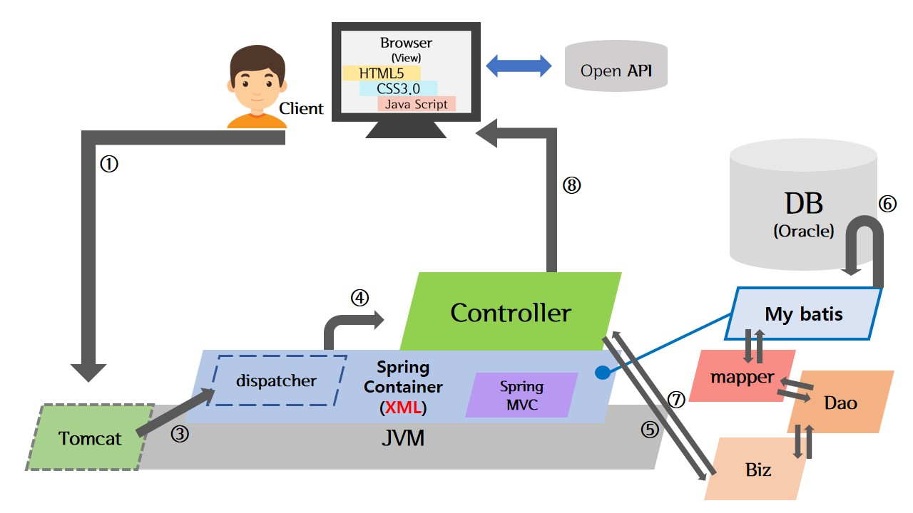
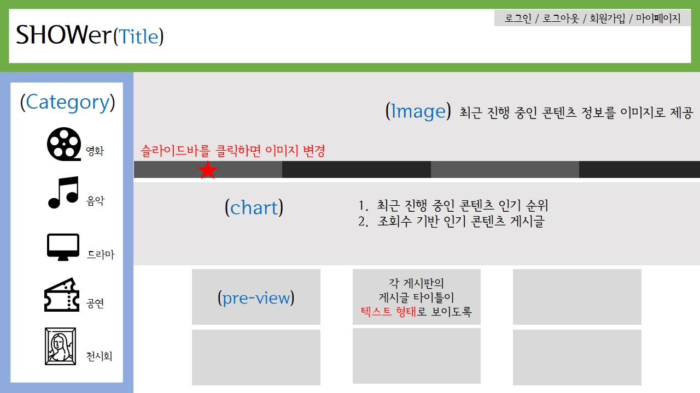
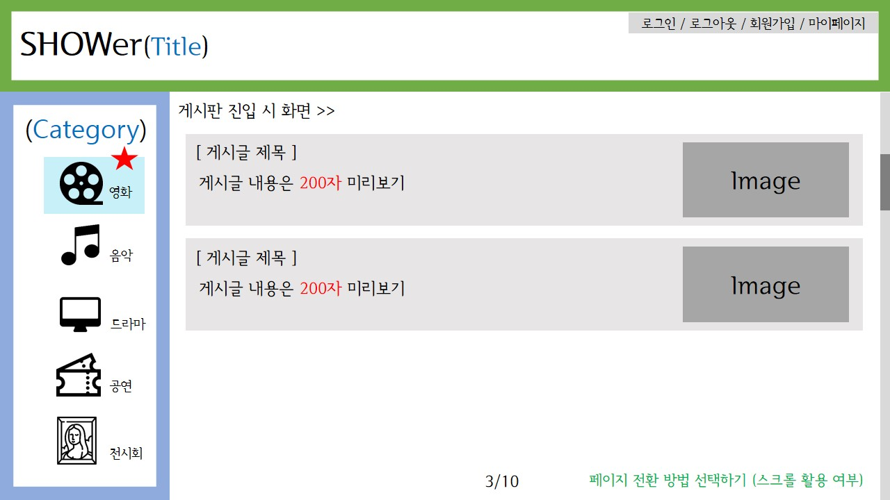
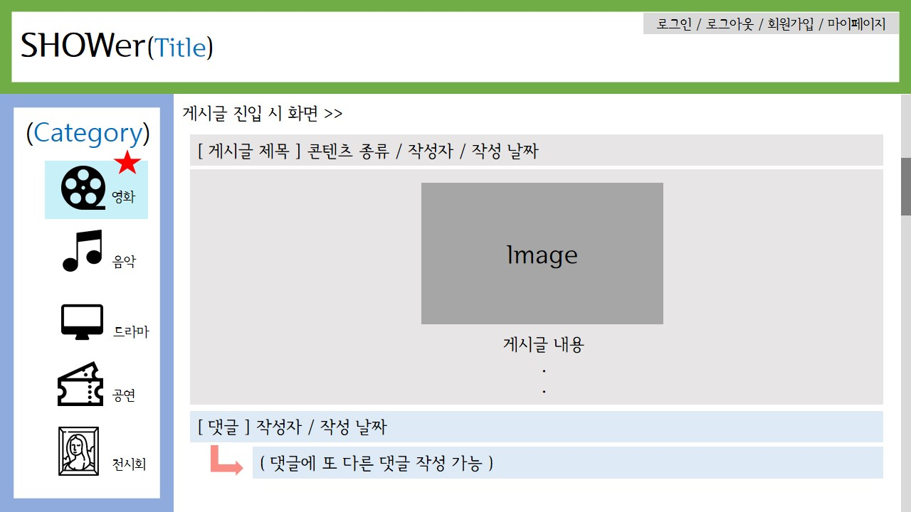

> 2019년 7월 9일 화요일 (day40) : 프로젝트 설계 → 시스템 구성 | ERD | 화면 설계

## 1. 주제 선정

- 주제 : 문화콘텐츠 리뷰사이트

- 기획 의도 : 하나의 콘텐츠를 다양한 목적으로 소비하는 사람들의 번거로움을 해소할 수 있는 사이트 제작의 필요성 → 여러가지 요구를 수용할 수 있는 '하나의' 사이트 제작

  ∴ 문화콘텐츠 관련 다양한 경험을 공유하고 정보를 제공하는 '문화콘텐츠 리뷰사이트'

- 주요 기능 및 목표 : ① 정보를 제공함 ② 경험을 공유함 ③ 다른 사람과 소통함

## 2. 시스템 구성

- 사용하는 소프트웨어 : 
  - **Web server** : Java → Spring
  - **Server connection** : Apache Tomcat 9.0
  - **Client** : HTML5, CSS3, JavaScript → BootStrap
  - **Database** : Oracle
- 시스템 구성도

## 3. Entity-Relationship Diagram (ERD)

_draft.JPG)

> 사용하는 데이터베이스 : T_USER (사용자 정보 관리) / CATEGORY (콘텐츠의 카테고리 분류) / POST (사용자의 게시글 및 댓글 관리) / CONTENT (게시글에 함께 제공되는 콘텐츠 정보 관리) / STAR (별점관리)

## 4. 화면 설계

