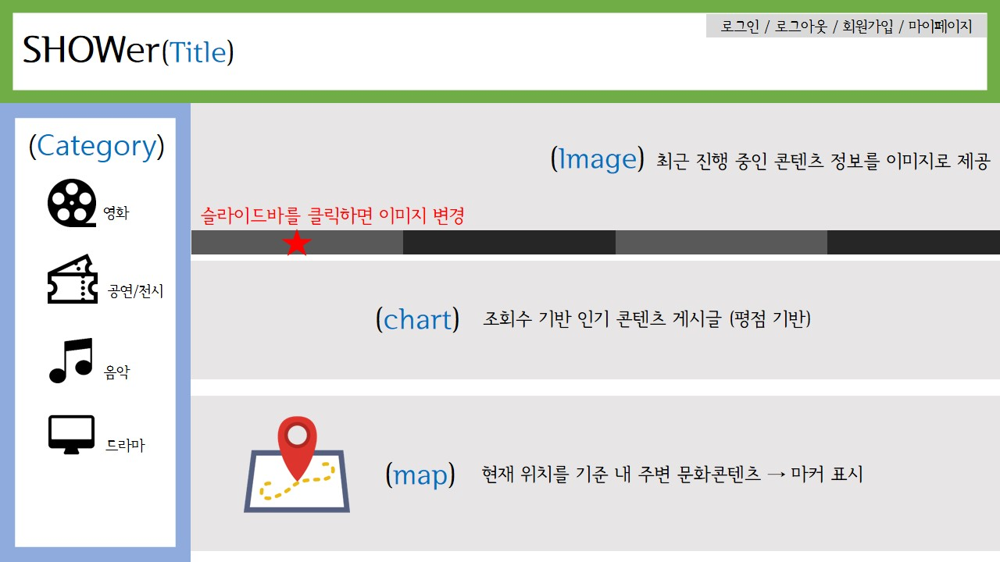
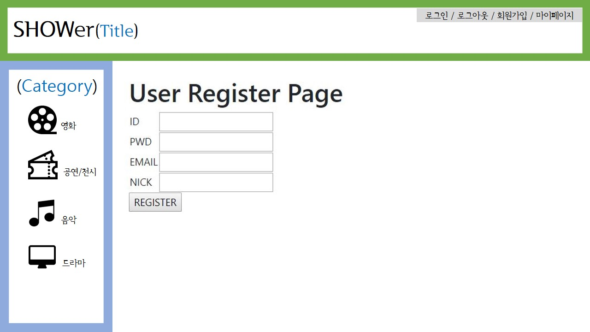

> 2019년 7월 12일 금요일 (day43) : UI 흐름도 및 화면 설계 추가 | 회원등록 | 로그인 | 게시판 페이지 만들기

:round_pushpin: ​오늘 내가 맡은 역할 → UI 흐름도 및 화면 설계 인포그래픽 만듦 & 게시판 이동 후 게시글 작성 페이지

<br>

## 1. UI 흐름도


## 2. 화면 설계

### 2-1. 메인페이지



### 2-2. 회원 정보 관리

- 회원가입



- 로그인


### 2-3. 게시판 진입

- 영화 & 공연/전시


- 음악 & 드라마


> 게시판 / 게시글 작성 / 게시글 선택 화면 동일

### 2-4. 게시글 작성

- 영화 & 공연/전시


### 2-5. 게시글 확인 

- 영화 & 공연/전시


## 3. 게시판

```jsp
<%@ page language="java" contentType="text/html; charset=UTF-8"
    pageEncoding="UTF-8"%>
<%@ taglib prefix="c" uri="http://java.sun.com/jsp/jstl/core" %>

<style>
#board{
margin : 0 auto;
padding-left : 300px;
padding-top : 200px;
}

#title_field {
width : 500px;
}

#content_field {
width:500px;
height : 550px;
resize : none; <!-- textarea의 크기 조정 방지 -->
}

</style>
<div class="center_page">
<form action="postaddimpl.sh" method="POST">
<table id="board">
<tbody>
<tr><td colspan=2><h5>리뷰쓰기</h5></td></tr>
<tr><td>종류</td><td>선택한 콘텐츠 이름 출력</td></tr>
<!-- 종류와 콘텐츠 입력 값은 사용자 선택 값을 받아서 뿌려줌 -->

<tr><td>제목</td><td><input type="text" name="title" id="title_field" 
                          placeholder="제목을 입력해주세요"></td></tr>
<tr><td>사진첨부</td><td><input type="file" name="img01"></td></tr>
<tr><td>내용</td><td><textarea name="text" id="content_field" 
placeholder="리뷰는 4000자 (공백 제외) 이내로 작성해주시기 바랍니다."></textarea></td></tr>

<tr><td>평점</td>
<td>
<select name="star" name="score">
<option value="">별점을 선택해주세요</option>
<option value="1">★☆☆☆☆ 1</option>
<option value="2">★★☆☆☆ 2</option>
<option value="3">★★★☆☆ 3</option>
<option value="4">★★★★☆ 4</option>
<option value="5">★★★★★ 5</option>
</select>
</td>
</tr>
    
<tr><td colspan=2 style="text-align:center"><input type="submit" value="확인"></td></tr>
    
</tbody>
</table>
</form>
</div>
```

> 게시글 작성 및 전송을 위한 페이지 → '확인' 버튼을 누르면 "postaddimpl.sh"로 이동하여 DB에 insert

<br>

-----------------------------------------------------------------------------------------------------------------------------------------------------------

:computer: 주말동안 해야 할 일 : API 데이터 CONTENT DB에 넣기 | 게시판에 게시글 나열 | 게시글 및 댓글 작성 | CSS

▶ 내가 할 일 : ① 게시글 등록 test ② 작성 된 게시글 페이지 접속 및 댓글 작성 ③ CSS 시작

